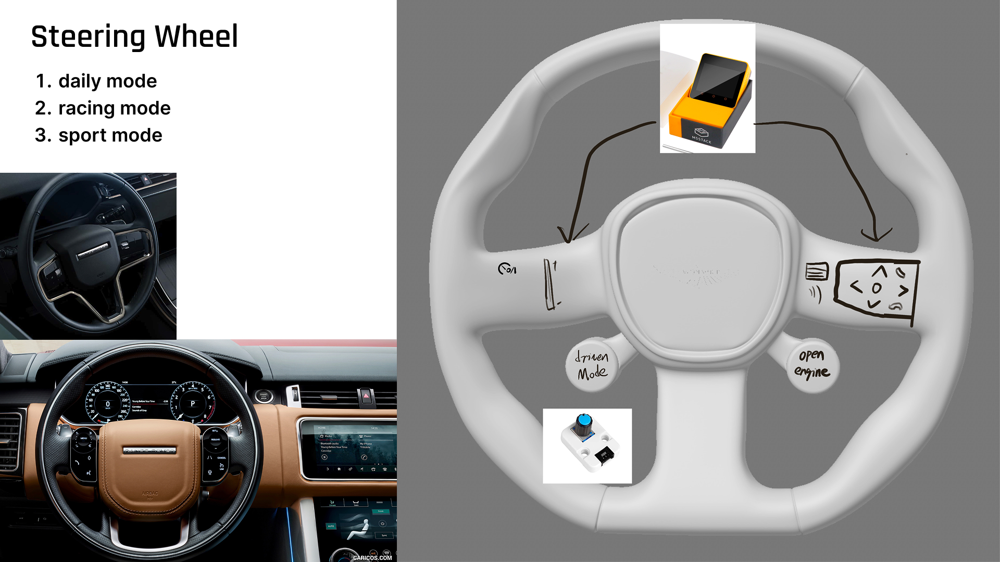

# Daniel's Final Documentation
## Introduction

The original idea for my project was to create an interactive steering wheel item that not only had the functionality of being able to interact normally, but also provided some track assistance. This product was designed for Aston Martin, so I'm also trying to incorporate the design of Aston Martin's existing steering wheel, but really this is difficult.

I'm hoping this steering wheel will give some track beginners the courage to hit the track and help them become better acquainted with this car in their hands!

  

## Implementation  

