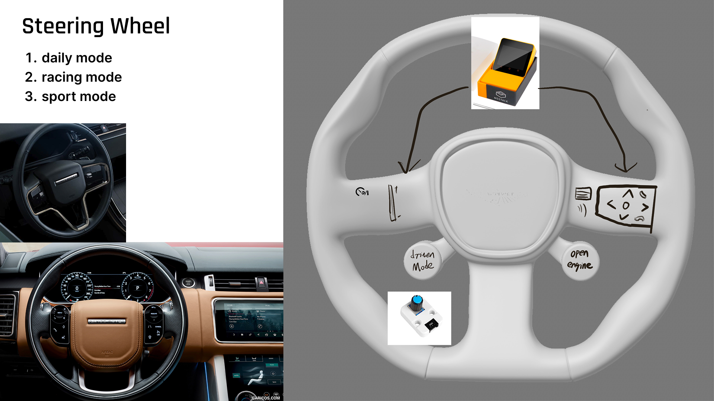
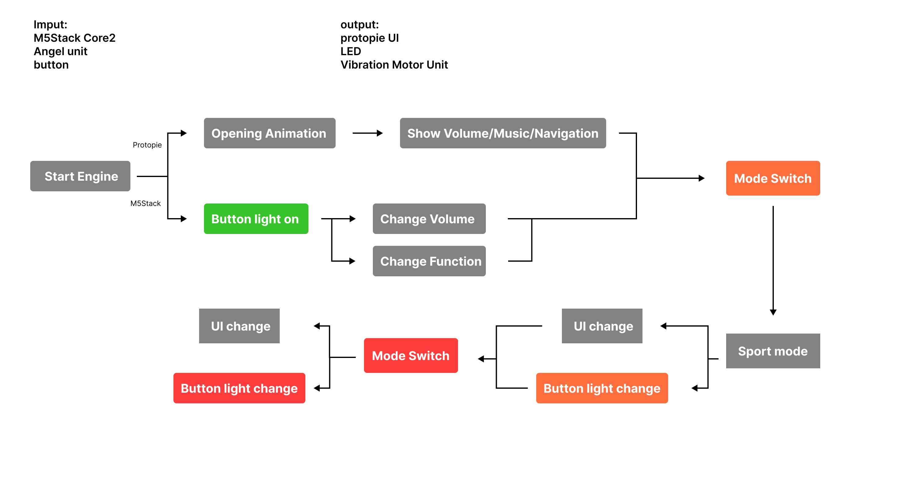
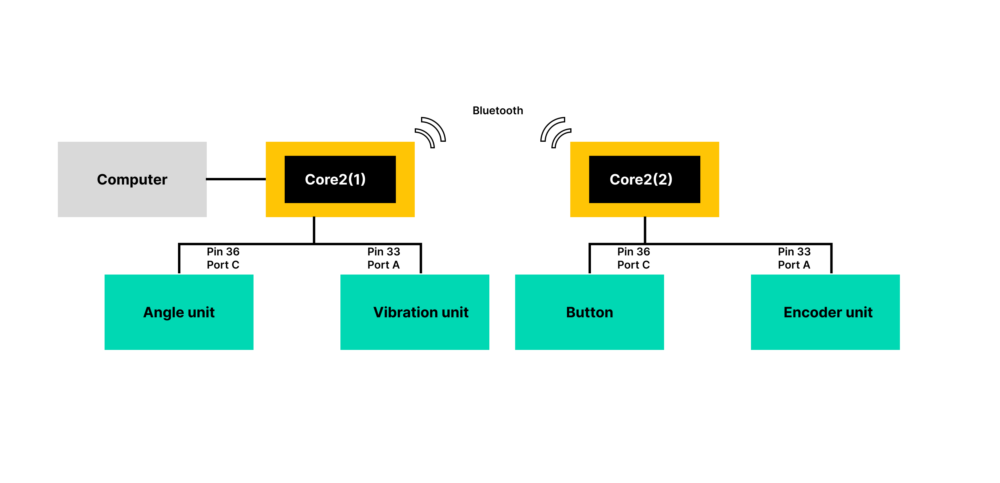

# Daniel's Final Documentation
## Introduction

The original idea for my project was to create an interactive steering wheel item that not only had the functionality of being able to interact normally, but also provided some track assistance. This product was designed for Aston Martin, so I'm also trying to incorporate the design of Aston Martin's existing steering wheel, but really this is difficult.

I'm hoping this steering wheel will give some track beginners the courage to hit the track and help them become better acquainted with this car in their hands!

  

## Implementation  

### State Diagram
  

### Hardware
- [M5Stack Core2](https://shop.m5stack.com/products/m5stack-core2-esp32-iot-development-kit-for-aws-iot-edukit). This one is the main core, and its function is to connect the computer to other components, and to display some basic UI on the steering wheel, providing a connection to the dashboard.

- [Button Unit](https://shop.m5stack.com/products/mechanical-key-button-unit).This is used as the car's starter button

- [Button Unit](https://shop.m5stack.com/products/encoder-unit). This is used to check how much the steering wheel has actually turned

- [Vibration Unit](https://shop.m5stack.com/products/vibration-motor-unit). This is used to alert the user to enter track mode and to give him/her a turn alert.

- [Angle Unit](https://shop.m5stack.com/products/angle-unit). This is used to switch modes

### Wire Diagram
  
