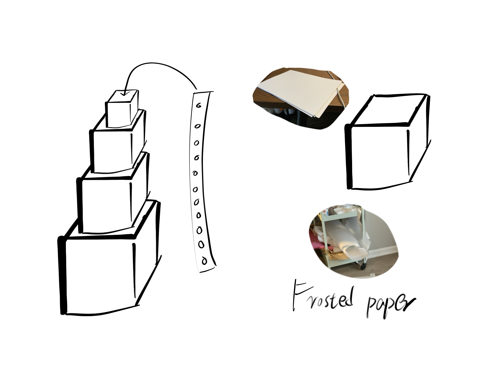

# Daniel Gu hw3

### Introduction
My idea was to use wait to create a charged animation, I wanted to make the lights dynamic, not just the difference between being on or off. So I created this piece
  

### State Diagram
1. When the button is pressed, the light is lit from No. 1 to No. 30, and the blue light speed is getting faster and faster.
2. When the ADC value is detected, the light will change the amount of power of the light with the size of the ADC value, the larger the value, the more lights are lit
3. When the button is long pressed, the light changes from blue to yellow.
4. when the button is short pressed twice, all lights go out
  

### Hardware
* __Light Strip__ - plays the main role as a reflection of the output results
* __Pushbuttons__- help users to control the light strip switch and switch the color of the light
* __analog__- helpsuser to control the brightness of the strip.

### Firmware
Controls the speed at which the light turns on
```
start_delay = 80  
end_delay = 20    
delay_decrement = (start_delay - end_delay) / 30 
```
Long press for three seconds to enter yellow
```
 if elapsed_time >= hold_threshold: 
            mode = "YELLOW_MODE
```
Tap to turn on the lights
```
        elif press_count == 1 and mode == "OFF_MODE":  
            mode = "BLUE_FLOW"
```
How blue light will be charge
```
 if mode == "BLUE_FLOW":  
        delay = start_delay  
        for i in range(30):
            np7[i] = (0, 0, 255)  
            np7.write()
            sleep_ms(int(delay))
            delay = max(delay - delay_decrement, end_delay)  

        mode = "ADC_MODE"  
```
How yellow light will be show
```

```


