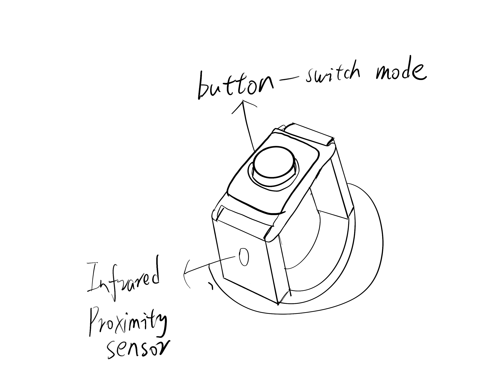
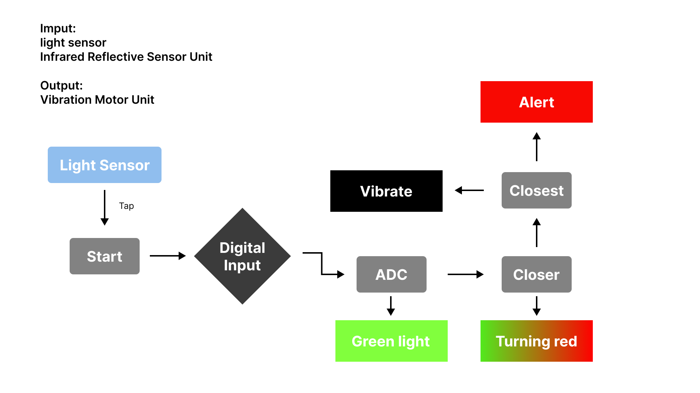

## Introduction
I would like to make a product to assist the blind to walk, because nowadays the blind walk with a guide stick, and the conditions of the guide stick are sometimes a nuisance to the people around and the blind users themselves, so I thought if I could alert the blind to obstacles in front of them without touching the blind stick, would it be more convenient for the blind to travel?

## Sketch
  

## State Diagram
When the user touches the switch, the product starts to operate, when the IR senses an obstacle in front, it will vibrate more and more with the sensing number getting smaller and smaller, reminding the user that there is an obstacle in front, and at the same time, the LED starts to flash, reminding the people around them to beware of avoiding/helping the user to avoid obstacles.
  

## Hardware
light sensor: Since blind users are not very good at recognizing the buttons accurately, I replaced the buttons with light sensors so that users can control the product on/off by simply hovering their hands over the unit.
IR sensor: Helps the user recognize the distance to obstacles ahead
Vibration： Vibrate to alert the user to the distance of obstacles in front of them

## Firmware
Using a light sensor instead of a switch
、、、
    global device_on, light_val_last
    light_val = light_sensor.read()
    
    if light_val < light_toggle_threshold and light_val_last >= light_toggle_threshold:
        device_on = not device_on
        print("device state:", "on" if device_on else "off")
        sleep(0.5)

The closer you are, the faster the vibration frequency.
、、、
 if ir_val > 1500: 
        delay_time = max(50, int(1000 - (ir_val - 1500)))  
        print(f"gap: {delay_time} ms")
        vibrator.on()
        sleep(delay_time / 2000) 
        vibrator.off()
        sleep(delay_time / 2000)
    else:

## Firmware

